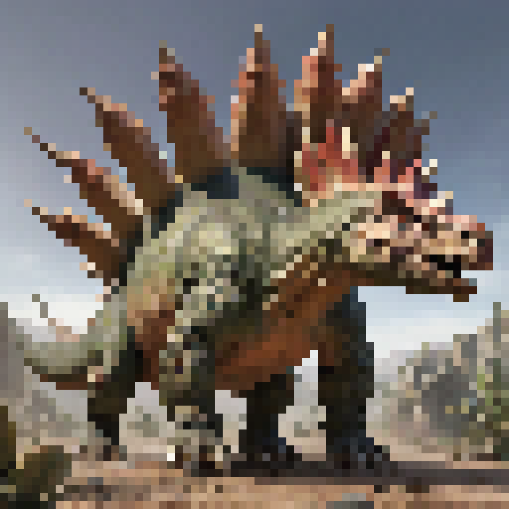
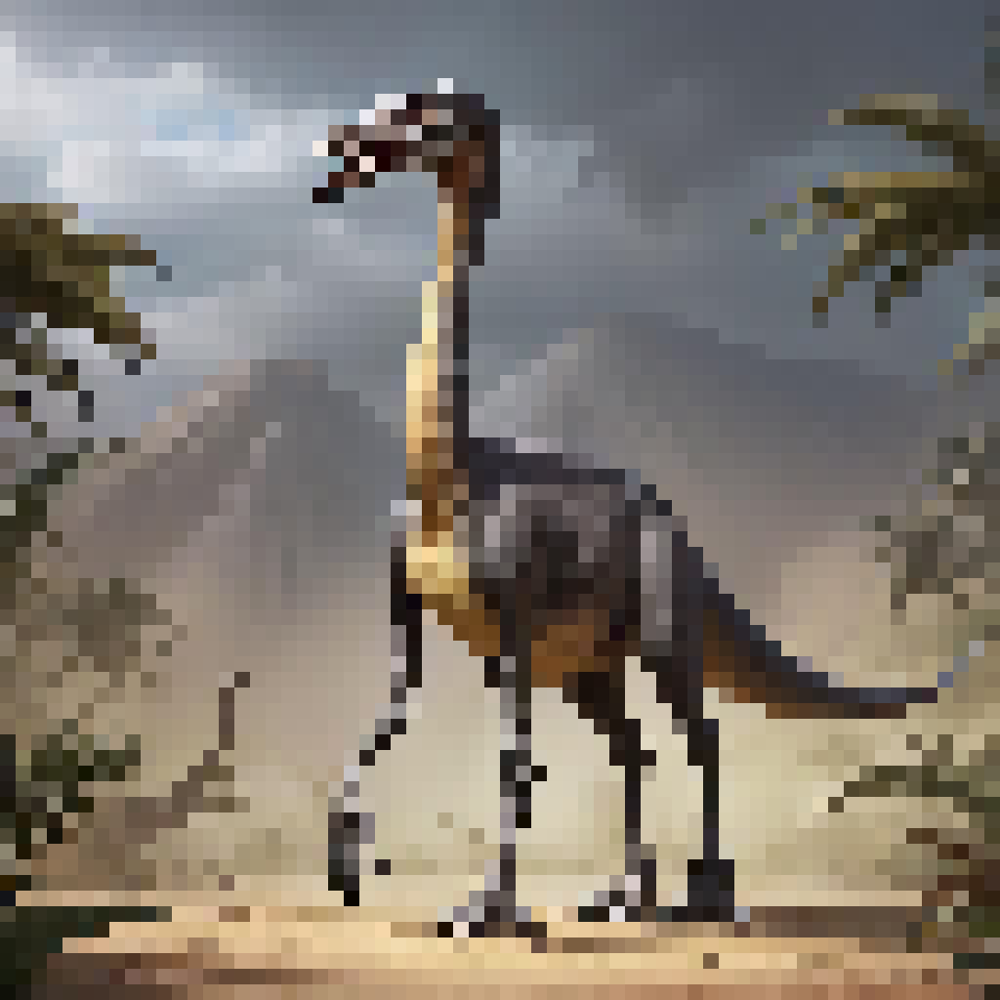
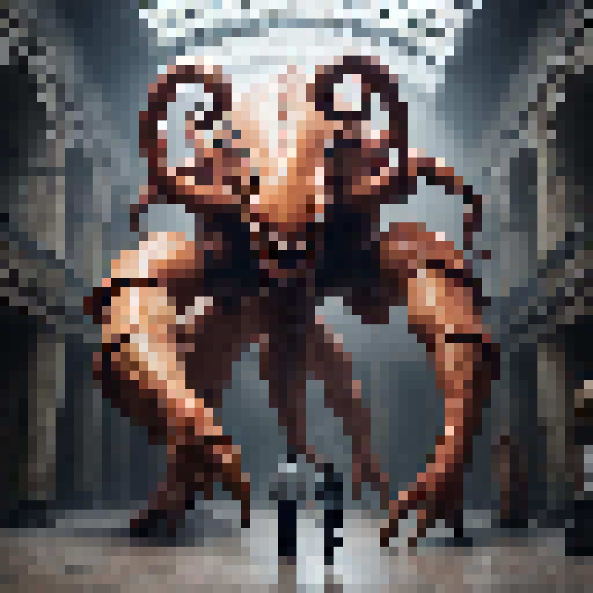

# **Dino Card TCG**

## _Game Design Document_

---

##### **[Copyright license](/LICENSE) /[Authors information](#team)** 

##
## _Index_

---

1. [Index](#index)
2. [Team](#team)
3. [Game Design](#game-design)
    1. [Summary](#summary)
    2. [Gameplay](#gameplay)
    3. [Mindset](#mindset)
4. [Technical](#technical)
    1. [Screens](#screens)
    2. [Controls](#controls)
    3. [Mechanics](#mechanics)
5. [Level Design](#level-design)
    1. [Themes](#themes)
        1. Ambience
        2. Objects
            1. Ambient
            2. Interactive
        3. Challenges
    2. [Game Flow](#game-flow)
6. [Development](#development)
    1. [Abstract Classes](#abstract-classes--components)
    2. [Derived Classes](#derived-classes--component-compositions)
7. [Graphics](#graphics)
    1. [Style Attributes](#style-attributes)
    2. [Graphics Needed](#graphics-needed)
8. [Sounds/Music](#soundsmusic)
    1. [Style Attributes](#style-attributes-1)
    2. [Sounds Needed](#sounds-needed)
    3. [Music Needed](#music-needed)
9. [Schedule](#schedule)

## _Team_ 

---

- Gabriel Muñoz Luna
- Karen Nikole Morales Rosas
- Felipe De Araújo Barbosa

## _Game Design_

---

### **Summary**

Summary
This is a card game where players fight to destroy the enemy's base. The goal is to strategically use your cards to reduce the opponent's base points to zero.

### **Gameplay**

In Dino Card a card trading game (TCG) involves a player pitting his deck, which has been pre-constructed from a wide selection of cards available in the game. Each card represents a dinosaur, which can be focused on attack or defense, some of them with abilities to use. The main objective is to reduce the life of the opponent's base to zero through strategies that involve attack, defense, and specialized use of cards.

The gameplay takes place in turns, where each player can play cards from their hand, using resources, in this case ambar that is awarded each turn. Interactions between cards, such as combat, are governed by specific rules that determine how they affect the opponent or the game state.

Strategy in Dino Card TCG is deep and complex, including deck construction before the game and tactical decisions during the game. Players must balance their decks well with a proper mix of attack, defense, and spell cards, anticipating enemy moves and adapting to the dynamics of the game.

### **Mindset**

The main obstacle players face is the opposing player's tactics and card choices, which may include powerful attacks and clever defenses. To overcome these obstacles, players must carefully manage their resources, anticipate their opponent's moves, and adapt their strategy on the fly.

## _Technical_

---

### **Screens**

1. Title Screen
    1. Options
        - Play
        - Decks
        - Credits
        - Exit
2. Game
    - Where the battle between cards takes place to see who is stronger.
4. Decks
    - Deck Editor
    - Select Deck
    - Save Deck
    - See all cards
6. Credits
7. Game Over
    - Statistics of the game
    - Score
8. Login
    - Regsiter
    - Login
9. Exit

### **Controls**

Mouse Click 

### **Mechanics**

---

- At the beginning of the game, the player is assigned 5 cards from the created deck, which will contain 20 cards.

- The 5 cards are spawn on bench.

- Up to 5 cards can be raised to game zone per turn if you have the necessary amber.

- Each turn the player will be assigned a certain amount of amber points and this amount will increase to a maximum of 8 per round.

- You can play and attack the cards as long as you have the necessary amount of amber.

- Passing a card to the play area has the cost of the card in amber, and attacking also costs you amber.

- In case of attacking or being attacked, you can only defend yourself if the person affected (the one being attacked) has cards on the bench.

- Within the costs of the letters, there are:
  - Cards of 1 - 3 cost, are cards which are fine at the beginning of the game, these have almost no much damage or life.
  - Cards of 4 - 5 cost, are cards more focused on the defense and attack of other cards.
  - Cards of 6 - 8 cost are cards that have special abilities.

- To win you have to destroy the enemy base.

- There are cards that allow you to regenerate life.

- Who starts the game is selected random.

## _Level Design_

---

There are not levels, only games

### **Themes**

1. Forest
    1. Mood
        1. Green, active
    2. Objects
        1. _Ambient_
            1. Hand
            2. Enemy hand
            3. Base
            4. Enemy base
            5. Elixir
        2. _Interactive_
            1. Cards
            2. Cards on hand
            3. End or pass button
            4. Bases
          
       

### **List of assets**
| Cards Images                                                                       |                                                                                 |                                                                               |
| ---------------------------------------------------------------------------------- | ------------------------------------------------------------------------------- | ----------------------------------------------------------------------------- |
|       |    |  |
|       |    |  |
|       |    |  |
|       |   | |
|      |   | |
|      |   | |
|      |   | |
|      |   | |
|      |   | |
|      |   | |
|      |   | |

### **Game Flow**

1. Player starts with 5 cards
2. Amber is given to the player on their turn
3. The player selects one or more cards and takes them to the game zone. (If player has the amount of amber necessary for all the cards)
4. On the player's next turn he can draw cards to game zone again (if he has elixir).
6. Same situation in case the enemy attacks.
7. Repeat the steps until your own or enemy base runs out of life.

## _Development_

---

- Set unity scenes.
- Make the database with dummy data.
- Make an API that connects to the database.
- Connect the api with unity.
- Login, create decks and play with the data in the database

### **Abstract Classes / Components**

1. BasePhysics
    1. BasePlayer
    2. BaseEnemy
    3. BaseObject
2. Board
   - Pass bench card to game
3. Cards
    1. Select and drop
    2. Mana cost
    3. Atack
    4. Life

### **Derived Classes / Component Compositions**

1. BasePlayer
    1. CardsMovement
    2. PlayerMouse
2. BaseEnemy
    1. EnemyAI
        - Enemy atack
        - Enemy defense
3. BoardObject
    1. ObjectBase
    2. ObjectElixir
    3. ObjectBanch
    4. ObjectCardsonhand

## _Graphics_

---

### **Style Attributes**

In the game we want to use a green-brown color palette, because your setting in which it takes place is a forest-type environment.

For the style of the game we are looking for the pixel style, we want the images on the cards to have a style like that, as well as the base or the buttons, we want the pixel style. We also want the background images, such as in the menus or in the game, to be pixel. We want the lines to be thin, or the least visible. When looking for the pixel style we don't want to have almost curves.

On the home screen implement a kind of tutorial with images to give players an idea of ​​what they can do.

### **Graphics Needed**

1. Cards
    1. Dinos-like
        1. T-Rex
        2. Compy
        3. Spinosaurus
        4. Argentavis
        5. Brontosaurus
        6. Stegosaurus
        7. Ankylosaurus
        8. Allosaurus
        9. Carnotaurus
        10. Pteranodon
        11. Triceratops
        12. Velociraptor
        13. Mosasaurus
        14. Megalodon
        15. Therizinosaurus
        16. Giganotosaurus
        17. Diplodocus
        18. Parasaurolophus
        19. Sabertooth
        20. Woolly Mammoth
        21. Direwolf
        22. Baryonyx
        23. Dodo
        24. Kaprosuchus
        25. Oviraptor
        26. Giganoto
        27. Gallimimus
        28. Pulmonoscorpius
        29. Archaeopteryx
2. Map
    1. Base
    2. Background/ Board
    3. Button
    4. Hand

## _Sounds/Music_

---

### **Style Attributes**

Again, consistency is key. Define that consistency here. What kind of instruments do you want to use in your music? Any particular tempo, key? Influences, genre? Mood?

Stylistically, what kind of sound effects are you looking for? Do you want to exaggerate actions with lengthy, cartoony sounds (e.g. mario&#39;s jump), or use just enough to let the player know something happened (e.g. mega man&#39;s landing)? Going for realism? You can use the music style as a bit of a reference too.

 Remember, auditory feedback should stand out from the music and other sound effects so the player hears it well. Volume, panning, and frequency/pitch are all important aspects to consider in both music _and_ sounds - so plan accordingly!

### **Sounds Needed**

Calm music that matches the atmosphere of the game

1. Effects
    1. Drop a card
    2. Card atack
    3. Mana given

### **Music Needed**

1. Slow-paced, nerve-racking &quot;forest&quot; track
2. Exciting &quot;castle&quot; track
3. Creepy, slow &quot;dungeon&quot; track
4. Happy ending credits track
5. Rick Astley&#39;s hit #1 single &quot;Never Gonna Give You Up&quot;

## _Schedule_

---

_(define the main activities and the expected dates when they should be finished. This is only a reference, and can change as the project is developed)_

1. develop base classes
    1. base entity
        1. base player
        2. base enemy
        3. base block
  2. base app state
        1. game world
        2. menu world
2. develop player and basic block classes
    1. physics / collisions
3. find some smooth controls/physics
4. develop other derived classes
    1. blocks
        1. moving
        2. falling
        3. breaking
        4. cloud
    2. enemies
        1. soldier
        2. rat
        3. etc.
5. design levels
    1. introduce motion/jumping
    2. introduce throwing
    3. mind the pacing, let the player play between lessons
6. design sounds
7. design music

